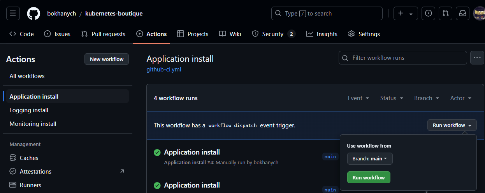
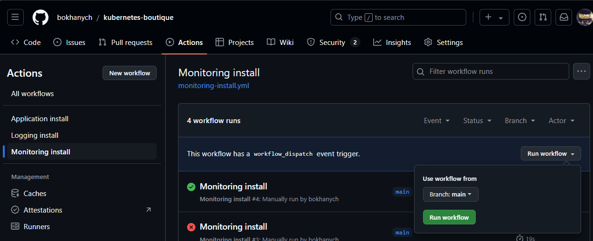
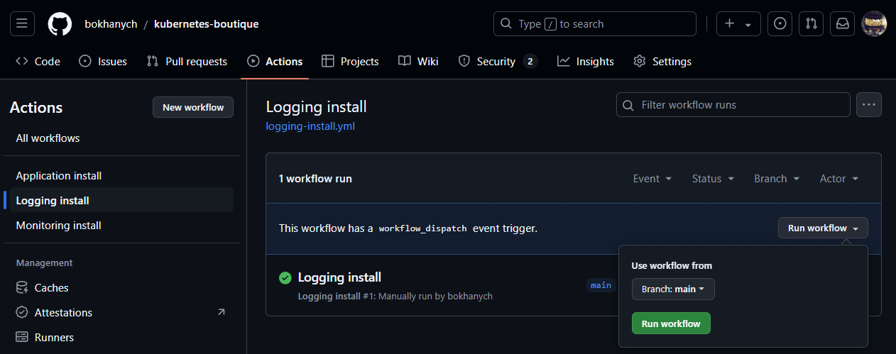

 **Проектная работа: "Инфраструктурная Managed k8s платформа для онлайн-магазина"**

Ссылки: 
- [приложение](https://bokhanych-demoshop.ust.inc)
- [grafana](http://65.109.41.169) # admin/prom-operator

**Реализовано:**
 - [x] Создание кластера [Hetzner Cloud with Kubespray, HCLOUD Controller Manager and Storage Driver]
 - [x] Присвоение меток нодам и запуск приложения только на нодах "worker"
 - [x] Изменение пространства имен приложения [onlineboutique]
 - [x] Изменение количества реплик важных сервисов приложения [cartservice,frontend,productcatalogservice]
 - [x] Мониторинг кластера [datasource, dashboards, telegram alerts]
 - [x] Логирование кластера [grafana/loki,grafana/promtail]
 - [x] CI [Github Actions]
 - [x] CD [ArgoCD]

## Создание кластера: 
```
# MANUAL: Install Kubernetes in Hetzner Cloud with Terraform, Kubespray, HCLOUD Controller Manager and Storage Driver: https://www.youtube.com/watch?v=S424jkxtEf0
mkdir kube-setup && cd kube-setup
git clone https://github.com/kubernetes-sigs/kubespray.git
VENVDIR=kubespray-venv
KUBESPRAYDIR=kubespray
python3 -m venv $VENVDIR
source $VENVDIR/bin/activate
cd $KUBESPRAYDIR
pip install -U -r requirements.txt
cd ..
mkdir -p clusters/eu-central
declare -a IPS=(10.98.0.2 10.98.0.3 10.98.0.4 10.98.0.5 10.98.0.6)
CONFIG_FILE=clusters/eu-central/hosts.yaml python3 kubespray/contrib/inventory_builder/inventory.py ${IPS[@]}
pip install ruamel.yaml
vi clusters/eu-central/hosts.yaml
vi clusters/eu-central/cluster-config.yaml
cd kubespray
vi inventory/sample/group_vars/k8s_cluster/addons.yml
ansible-playbook -i ../clusters/eu-central/hosts.yaml -e @../clusters/eu-central/cluster-config.yaml --become --become-user=root cluster.yml
```

Присвоение меток нодам:
```
kubectl taint nodes <node_name> node-role.kubernetes.io/control-plane:NoSchedule
kubectl label nodes <node_name> node-role.kubernetes.io/worker=worker

NAME    STATUS   ROLES           AGE   VERSION
node1   Ready    control-plane   12d   v1.31.1
node2   Ready    control-plane   12d   v1.31.1
node3   Ready    worker          12d   v1.31.1
node4   Ready    worker          12d   v1.31.1
node5   Ready    worker          12d   v1.31.1
```
Запуск приложения только на нодах "worker":
```
    spec:
      affinity:
        nodeAffinity:
          requiredDuringSchedulingIgnoredDuringExecution:
            nodeSelectorTerms:
            - matchExpressions:
              - key: node-role.kubernetes.io/worker
                operator: In
                values:
                - worker
```

Изменение пространства имен приложения:
```
metadata:
  namespace: onlineboutique
```

Изменение количества реплик:
```
spec:
  replicas: 2
```

## Установка ArgoCD:
Для установки приложения используется ArgoCD. Мониторит изменения в папке проекта application.
```
# Install Argo CD
kubectl create namespace argocd
kubectl apply -n argocd -f https://raw.githubusercontent.com/argoproj/argo-cd/stable/manifests/install.yaml

# Change the argocd-server service type to LoadBalancer
kubectl patch svc argocd-server -n argocd -p '{"spec": {"type": "LoadBalancer"}}'

# Get password
kubectl -n argocd get secret argocd-initial-admin-secret -o jsonpath="{.data.password}" | base64 --decode
pGgVXkh1b6snGyET

# Create project
kubectl apply -f argocd/project.yaml 

# SSH keys:
1. Github project settings - Deploy keys - Add deploy key - paste my_key.pub
2. ArgoCD settings - Repositories - CONNECT REPO - VIA SSH - paste my_key

# Create application
kubectl apply -f argocd/application.yaml
```

## Установка приложения:
Состоит из двух этапов, CI и CD. CI запускается с помощью gitlab runner на кнопку "Run workflow". CD - автоматически, с помощью ArgoCD.

Процесс такой: скачивает репозиторий проекта на ubuntu-latest (раннер от гита); логинится в dockerhub (используя секреты); скачивает оригинальные образы приложения; тегирует их новой версией (новая версия - номер задачи); отправляет в мой репозиторий [dockerhub](https://hub.docker.com/repository/docker/bokhanych/kubernetes-boutique/general); после чего меняет версию образов приложения в манифесте application/boutique-app.yaml и пушит обновленный манифест в мой репозиторий, где его и замечает ArgoCD и разворачивает новую версию приложения. 

## Установка мониторинга кластера:
Для мониторинга используется стек Grafana + Prometheus. 
При разворачивании чарта автоматически добавляется источник данных Prometheus, мой дашборд "bokhanych-dashboard" с подключенными алертами при падении подов приложения в Telergam группу.
Устанавливается с помощью gitlab runner на кнопку "Run workflow".
 

## Установка логирование кластера:
Для работы с логами используется стек Grafana + Loki. В роли хранилища подключен бакет от яндекса.
Устанавливается с помощью gitlab runner на кнопку "Run workflow".


